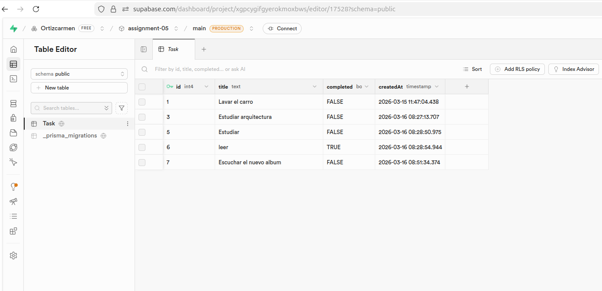

# Assignment 05 - Task Manager 🌸

Full-stack task manager application built with a monorepo structure.

## Tech Stack
- **Monorepo:** npm workspaces
- **Frontend:** Next.js deployed on Vercel
- **Backend:** Express.js + Prisma deployed on Render
- **Database:** PostgreSQL on Supabase
- **Secrets Management:** Doppler
- **API Documentation:** Swagger

## Frontend URL
https://assignment-05-frontend-beige.vercel.app

## Backend URL
https://assignment-05-backend-0xcd.onrender.com

## API Documentation
https://assignment-05-backend-0xcd.onrender.com/api-docs

## Monorepo Structure
```
assignment-05/
├── frontend/     → Next.js app (Vercel)
├── backend/      → Express API + Prisma (Render)
└── package.json  → npm workspaces config
```

## Migrations
Migrations are located in `backend/prisma/migrations/` and were applied using Prisma Migrate.

## Database Screenshot

