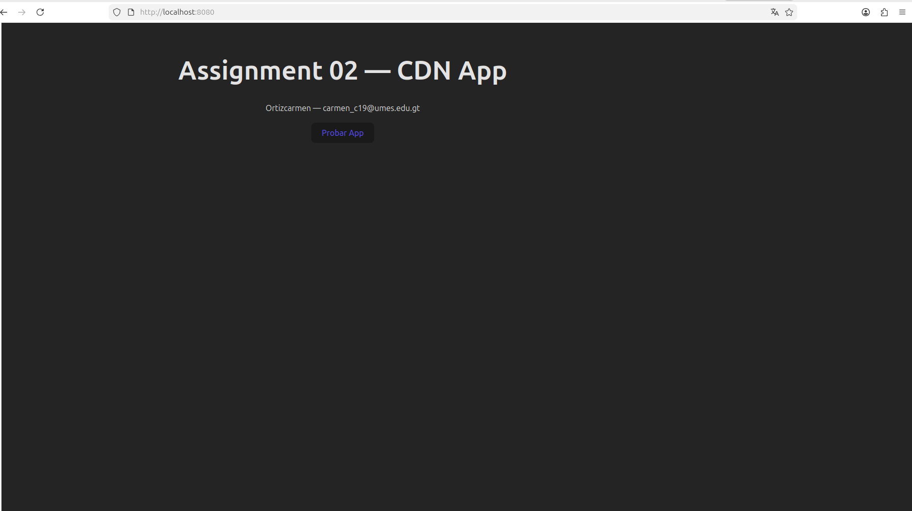
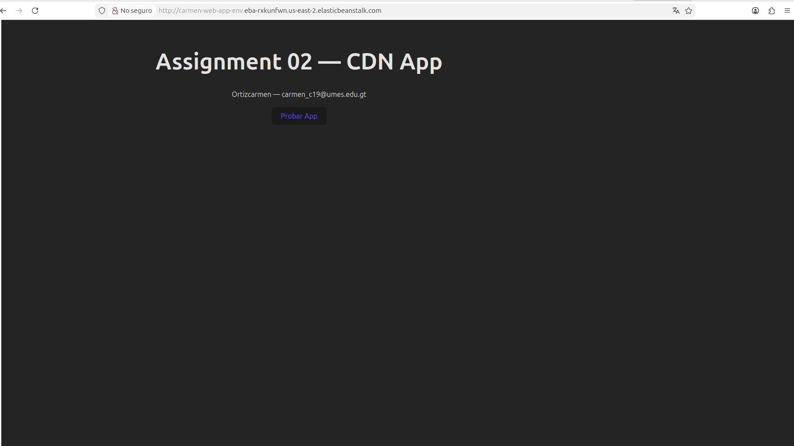
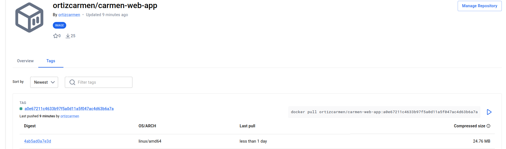
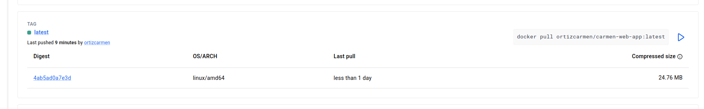
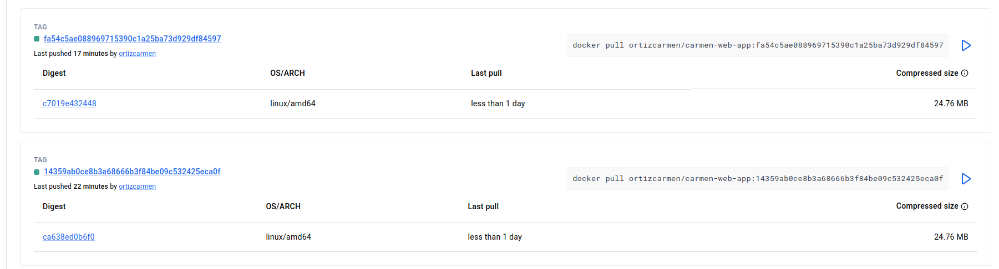

# Assignment 04 - Docker Hub

## Descripcion
Aplicacion web estatica dockerizada y publicada en Docker Hub con tags automaticos 
mediante GitHub Actions y Doppler.

## URL imagen Docker Hub
https://hub.docker.com/r/ortizcarmen/carmen-web-app

## Pipeline GitHub Actions
El pipeline se ejecuta en cada push a `assignment-04` y realiza:
1. Login a Docker Hub con credenciales de Doppler
2. Build de la imagen Docker
3. Push con dos tags: `latest` y el SHA del commit

## Tags en Docker Hub
Cada commit genera dos tags:
- `latest` - siempre apunta a la imagen mas reciente
- `SHA del commit` - identifica cada build especifico

## Capturas

### Aplicacion funcionando

### Aplicacion en AWS

### Imagenes y tags en Docker Hub

 
 
