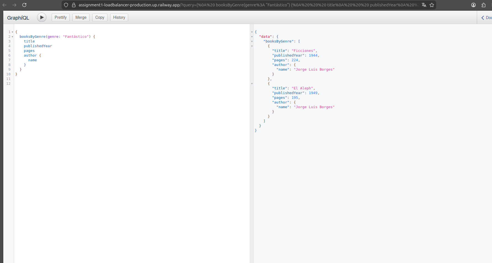
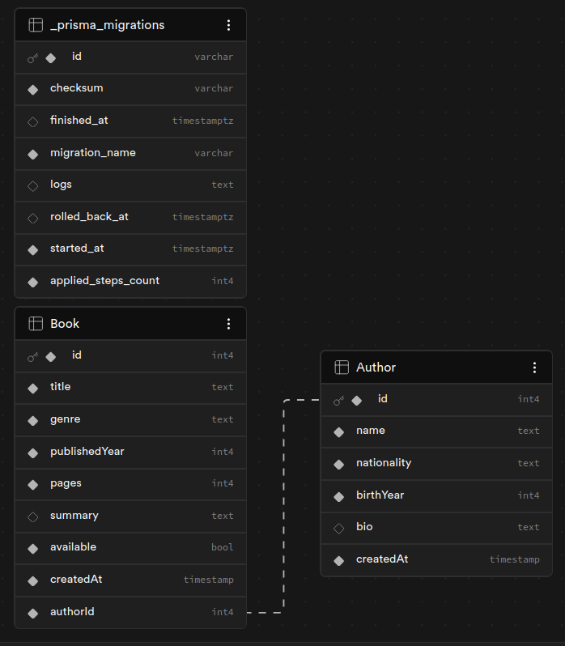
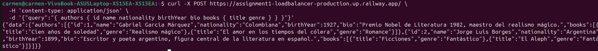
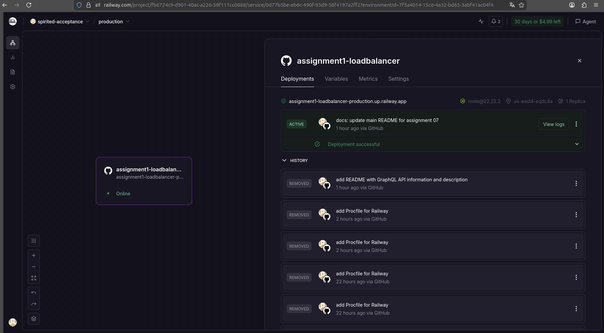

# Assignment 07 — GraphQL API

## Descripción
Este proyecto implementa una API utilizando GraphQL con el objetivo de demostrar cómo se pueden generar endpoints dinámicos sin necesidad de ajustarlos a campos específicos, a diferencia de REST.

## Tecnologías utilizadas
- Node.js
- Graphql
- Prisma ORM
- PostgreSQL
- Supabase (Base de datos en la nube)
- Railway (Deploy del backend)

---

## Endpoint público
```
https://assignment1-loadbalancer-production.up.railway.app/
```
Este endpoint permite realizar consultas GraphQL sin autenticación.

---

## ¿Cómo funciona GraphQL en este proyecto?
A diferencia de REST, GraphQL permite al cliente solicitar únicamente los campos que necesita. Un solo endpoint responde todas las consultas.

Ejemplo — solo títulos:
```graphql
query {
  books {
    title
  }
}
```

Ejemplo — todos los campos:
```graphql
query {
  books {
    id
    title
    genre
    publishedYear
    pages
    summary
    available
    author {
      name
      nationality
    }
  }
}
```

---

## Base de datos
Se utilizó Supabase como proveedor de base de datos PostgreSQL en la nube. Se definieron modelos en `schema.prisma`, se ejecutaron migraciones para crear las tablas y se insertaron datos de prueba con seed.

---

## Modelos disponibles

### Author (Autor)

| Campo | Tipo | Descripción |
|-------|------|-------------|
| id | Int | Identificador único autoincremental |
| name | String | Nombre completo del autor |
| nationality | String | Nacionalidad del autor |
| birthYear | Int | Año de nacimiento |
| bio | String | Biografía corta (opcional) |
| createdAt | String | Fecha de creación del registro |
| books | [Book] | Lista de libros asociados al autor |

### Book (Libro)

| Campo | Tipo | Descripción |
|-------|------|-------------|
| id | Int | Identificador único autoincremental |
| title | String | Título del libro |
| genre | String | Género literario |
| publishedYear | Int | Año de publicación |
| pages | Int | Número de páginas |
| summary | String | Resumen del libro (opcional) |
| available | Boolean | Disponibilidad del libro |
| createdAt | String | Fecha de creación del registro |
| author | Author | Autor relacionado |
| authorId | Int | ID del autor (llave foránea) |

### Relación entre modelos
- Un `Author` puede tener múltiples `Books`
- Un `Book` pertenece a un `Author`

---

## Queries disponibles

### Obtener todos los libros
```graphql
query {
  books {
    id
    title
    genre
    publishedYear
    pages
    available
    author {
      name
    }
  }
}
```

### Obtener un libro por ID
```graphql
query {
  book(id: 1) {
    title
    summary
    author {
      name
      nationality
    }
  }
}
```

### Obtener todos los autores
```graphql
query {
  authors {
    id
    name
    nationality
    birthYear
    books {
      title
    }
  }
}
```

### Obtener un autor por ID
```graphql
query {
  author(id: 1) {
    name
    bio
    books {
      title
      genre
    }
  }
}
```

### Filtrar libros por género
```graphql
query {
  booksByGenre(genre: "Fantástico") {
    title
    publishedYear
    author {
      name
    }
  }
}
```

---

## Ejemplos de uso con curl

### Todos los libros
```bash
curl -X POST https://assignment1-loadbalancer-production.up.railway.app/ \
  -H 'content-type: application/json' \
  -d '{"query":"{ books { title genre author { name } } }"}'
```

### Todos los autores
```bash
curl -X POST https://assignment1-loadbalancer-production.up.railway.app/ \
  -H 'content-type: application/json' \
  -d '{"query":"{ authors { name nationality books { title } } }"}'
```

---

## Evidencias del funcionamiento

### Endpoint público en Railway
Muestra que la API está desplegada y accesible públicamente.


### Tablas en Supabase
Se observan las tablas `Author` y `Book` con datos creados correctamente.


### Query funcionando
Ejemplo de una consulta GraphQL ejecutada correctamente y devolviendo datos.


### Despliegue en Railway
Servicio activo en Railway mostrando el estado en línea.


---

## Conclusión
GraphQL permite construir APIs más flexibles y eficientes. El cliente decide exactamente qué datos necesita, reduciendo tráfico innecesario y mejorando el rendimiento.
