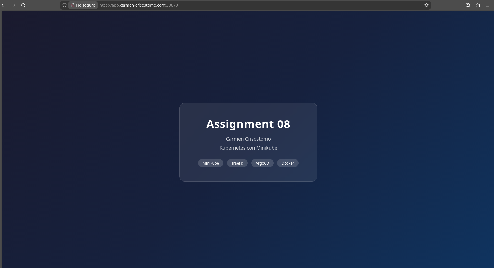
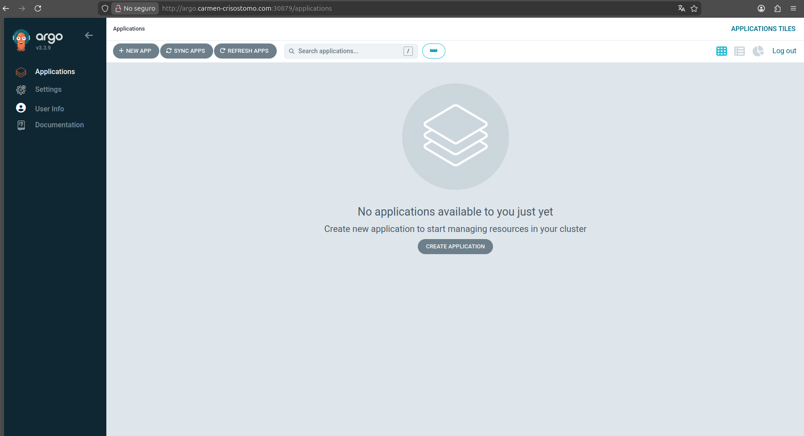

# Assignment 08 - Kubernetes con Minikube

## Descripción

En este assignment se configuró un clúster de Kubernetes local usando Minikube. Se instalaron Traefik como controlador de rutas y ArgoCD para el manejo del estado de las aplicaciones. Se desplegó una aplicación web estática con nginx, accesible mediante un dominio local configurado en el DNS del sistema.

## Aplicación desplegada

URL: `http://app.carmen-crisostomo.com:30879`

## ArgoCD

URL: `http://argo.carmen-crisostomo.com:30879`

## Configuración DNS local

Se editó el archivo /etc/hosts para resolver los dominios localmente:

192.168.49.2 app.carmen-crisostomo.com
192.168.49.2 argo.carmen-crisostomo.com

## Manifiestos IaC

- k8s/app/deployment.yaml - Deployment y Service de la app
- k8s/app/ingressroute.yaml - IngressRoute de la app con dominio app.carmen-crisostomo.com
- k8s/argocd/ingressroute.yaml - IngressRoute de ArgoCD con dominio argo.carmen-crisostomo.com
- k8s/traefik/clusterrole.yaml - Permisos de Traefik para leer todos los namespaces
- k8s/traefik/values.yaml - Valores de configuración de Traefik

## Comandos ejecutados

minikube start --driver=docker --cpus=2 --memory=4096
kubectl create namespace traefik
helm repo add traefik https://traefik.github.io/charts
helm repo update
helm install traefik traefik/traefik --namespace traefik -f k8s/traefik/values.yaml
kubectl create namespace argocd
kubectl apply -n argocd -f https://raw.githubusercontent.com/argoproj/argo-cd/stable/manifests/install.yaml
eval $(minikube docker-env)
docker build -t mi-app:latest .
kubectl apply -f k8s/app/deployment.yaml
kubectl apply -f k8s/app/ingressroute.yaml
kubectl apply -f k8s/argocd/ingressroute.yaml
kubectl apply -f k8s/traefik/clusterrole.yaml
echo "$(minikube ip) app.carmen-crisostomo.com" | sudo tee -a /etc/hosts
echo "$(minikube ip) argo.carmen-crisostomo.com" | sudo tee -a /etc/hosts
kubectl patch configmap argocd-cmd-params-cm -n argocd --type merge -p '{"data":{"server.insecure":"true"}}'
kubectl rollout restart deployment/argocd-server -n argocd
