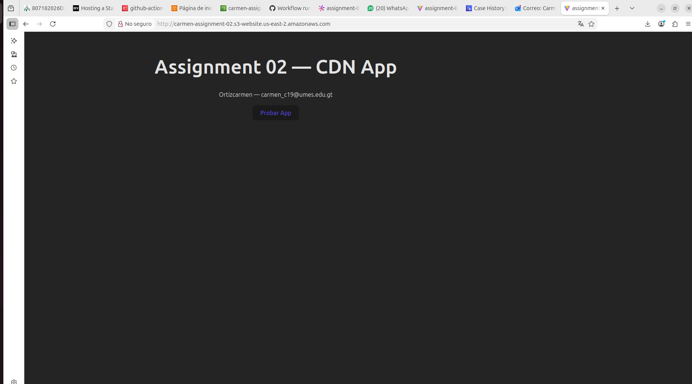
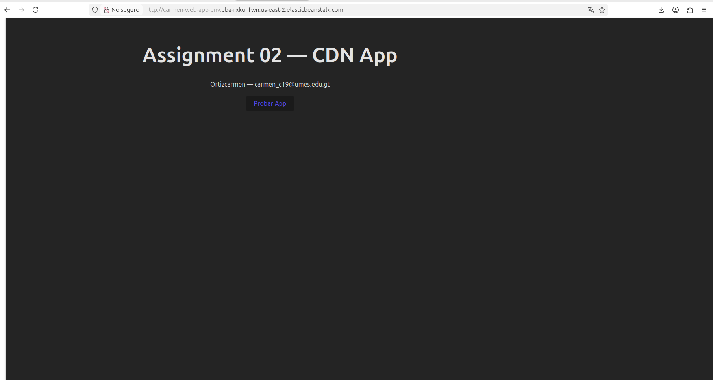
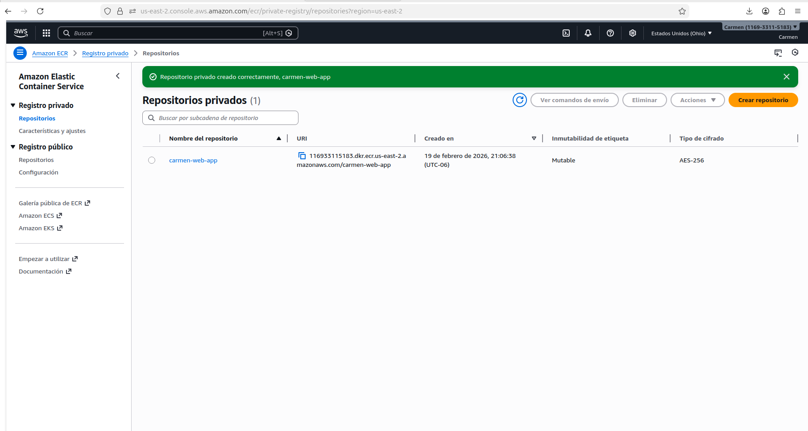
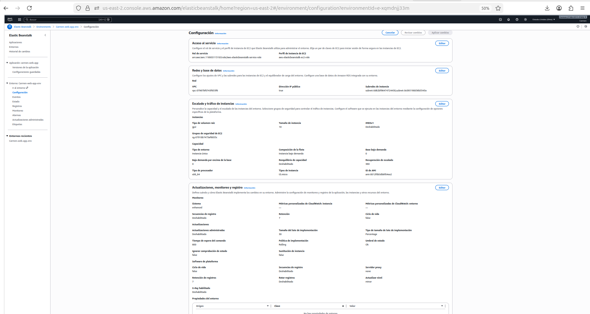
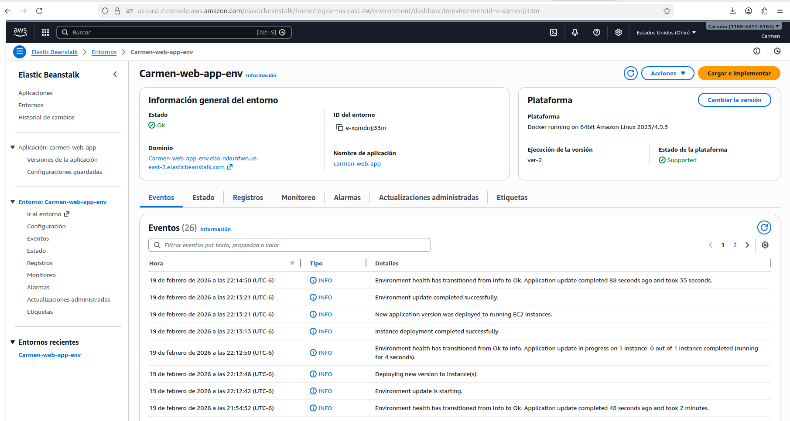
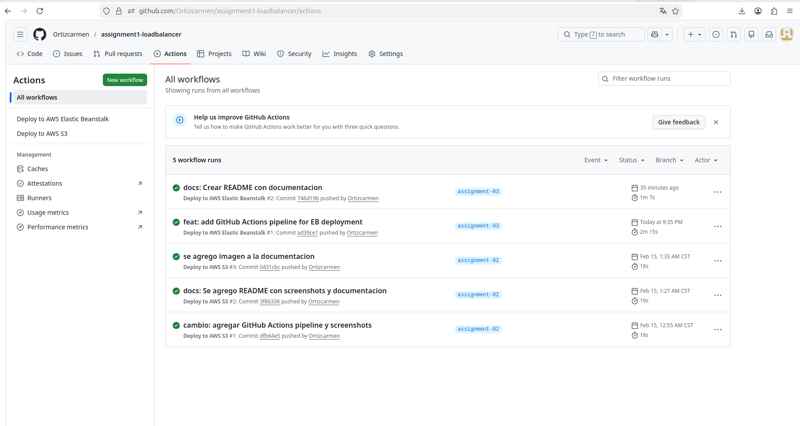
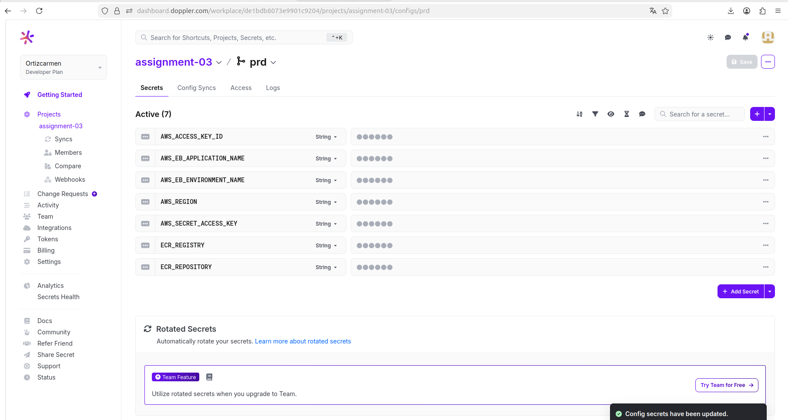

# Assignment 03 - AWS Elastic Beanstalk + Docker

**NOmbre:** Carmen Ortiz  
**Email:** carmen_c19@umes.edu.gt  
**Universidad:** Universidad Mesoamericana  
**Curso:** Arquitectura de Sistemas II

---

## Aplicación
Aplicación web estática desplegada en AWS Elastic Beanstalk usando Docker.

## URL de AWS Elastic Beanstalk
http://Carmen-web-app-env.eba-rxkunfwn.us-east-2.elasticbeanstalk.com

## Husky
Husky está configurado para ejecutar ESLint y Prettier antes de cada commit automáticamente.
Ejemplo:
- Se hace `git commit`
- Husky ejecuta ESLint para verificar errores de código
- Husky ejecuta Prettier para formatear el código
- Si todo pasa, el commit se completa

## Tecnologías
- Vite
- Docker
- AWS Elastic Beanstalk
- GitHub Actions
- Doppler
- Husky + ESLint + Prettier

### Aplicación funcionando

### AWS Elastic Beanstalk - Entorno

### AWS Elastic Beanstalk - Dashboard

### AWS Elastic Beanstalk - Configuración

### AWS Elastic Beanstalk - Ambiente web

### Pipeline GitHub Actions

### Secretos configurados

##  Autora

**Carmen Ortiz**  
Universidad Mesoamericana  
Febrero 2026
