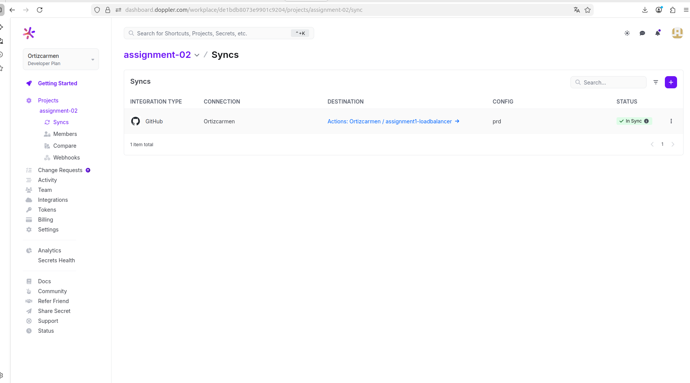
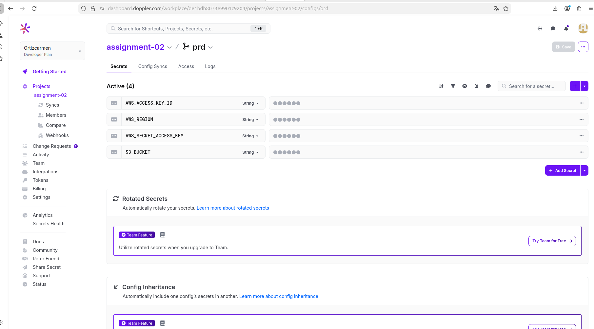
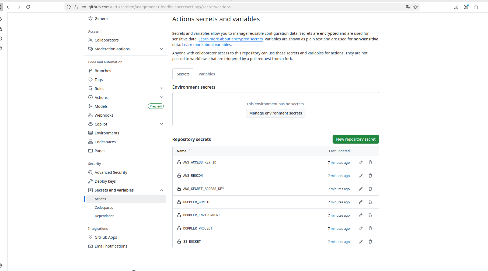

# Assignment 02 - Web Application with AWS CDN

**NOmbre:** Carmen Ortiz  
**Email:** carmen_c19@umes.edu.gt  
**Universidad:** Universidad Mesoamericana  
**Curso:** Arquitectura de Sisemas II

---

## 📝 Descripción

Aplicación web desarrollada con **Vite + Vanilla JavaScript** y desplegada automáticamente en **AWS S3** mediante **GitHub Actions**. La aplicación será distribuida globalmente a través de **AWS CloudFront CDN**.

---

## 🚀 Tecnologías Utilizadas

- **Frontend:** Vite + Vanilla JavaScript
- **Hosting:** AWS S3
- **CDN:** AWS CloudFront (en configuración)
- **CI/CD:** GitHub Actions
- **Secrets Management:** Doppler
- **Control de versiones:** Git + GitHub

---

## Arquitectura
```
GitHub Push → GitHub Actions → Build → AWS S3 → CloudFront CDN → Usuarios
                                ↑
                            Doppler (Secrets)
```

---

##  Capturas de Pantalla

### 1. Configuración de Doppler - Config Syncs
Integración de Doppler con GitHub para sincronización automática de secretos.



### 2. Variables en Doppler
Credenciales de AWS almacenadas de forma segura en Doppler.



### 3. Secretos en GitHub
Secretos sincronizados automáticamente desde Doppler a GitHub Actions.



### 4. Aplicación Funcionando
Interfaz de la aplicación web desplegada.


---

## 🌐 URLs de Acceso

### Bucket S3 (Temporal)
```
http://carmen-assignment-02.s3-website.us-east-2.amazonaws.com
```

### CloudFront CDN (Configuración pendiente)
```
⏳ Pendiente de verificación de cuenta AWS
URL se agregará cuando AWS verifique la cuenta
```

---

## ⚙️ Pipeline de GitHub Actions

El pipeline se ejecuta automáticamente en cada push a la rama `assignment-02`:

### Pasos del Pipeline:

1. **Checkout:** Clona el código del repositorio
2. **Setup Node.js:** Configura el entorno de Node.js v20
3. **Install:** Instala dependencias con `npm ci`
4. **Build:** Genera la carpeta `dist/` con `npm run build`
5. **Configure AWS:** Configura credenciales desde secretos de GitHub
6. **Upload to S3:** Sincroniza `dist/` con el bucket S3
7. **Invalidate CloudFront:** Invalida caché (cuando CloudFront esté activo)

---

## 📦 Estructura del Proyecto
```
assignment-02/
├── .github/
│   └── workflows/
│       └── deploy.yml          # Pipeline de GitHub Actions
├── screenshots/                 # Capturas para documentación
│   ├── doppler-config-syncs.png
│   ├── doppler-variables.png
│   ├── github-secrets.png
│   └── app-screenshot.png
├── src/
│   ├── main.js                 # Código JavaScript principal
│   └── style.css               # Estilos de la aplicación
├── public/                      # Archivos estáticos
├── index.html                   # Página principal
├── package.json                 # Dependencias y scripts
├── vite.config.js              # Configuración de Vite
└── README.md                    # Este archivo
```

---

## 🔐 Configuración de Secretos

Los siguientes secretos están configurados en Doppler y sincronizados con GitHub:

- `AWS_ACCESS_KEY_ID`: Credencial de acceso a AWS
- `AWS_SECRET_ACCESS_KEY`: Clave secreta de AWS
- `AWS_REGION`: Región de AWS (us-east-2)
- `S3_BUCKET`: Nombre del bucket S3 (carmen-assignment-02)

---

## 🚀 Deployment

### Deployment Automático
Cada push a la rama `assignment-02` dispara el pipeline automáticamente.

### Deployment Manual (Local)
```bash
# Instalar dependencias
npm install

# Desarrollo local
npm run dev

# Build para producción
npm run build

# Preview del build
npm run preview
```

---

## 📊 Estado del Proyecto

| Componente | Estado |
|-----------|--------|
| Aplicación Vite |   ✅ Completado |
| Bucket S3 |         ✅ Configurado |
| Usuario IAM |       ✅ Creado |
| Doppler |           ✅ Configurado |
| GitHub Actions |    ✅ Funcionando |
| CloudFront CDN |    ⏳ Pendiente verificación AWS |

---

## 📝 Commits

Este proyecto incluye múltiples commits que demuestran el desarrollo incremental:

- Initial commit: Configuración inicial
- Vite project running locally
- Se agregó el estilo de la interfaz
- Add GitHub Actions pipeline and screenshots
- (Más commits durante el desarrollo)

---

## 🎓 Aprendizajes

- Configuración de pipelines CI/CD con GitHub Actions
- Gestión segura de secretos con Doppler
- Deployment en AWS S3
- Configuración de CDN con CloudFront
- Automatización de deploys

---

##  Autora

**Carmen Ortiz**  
Universidad Mesoamericana  
Febrero 2026
